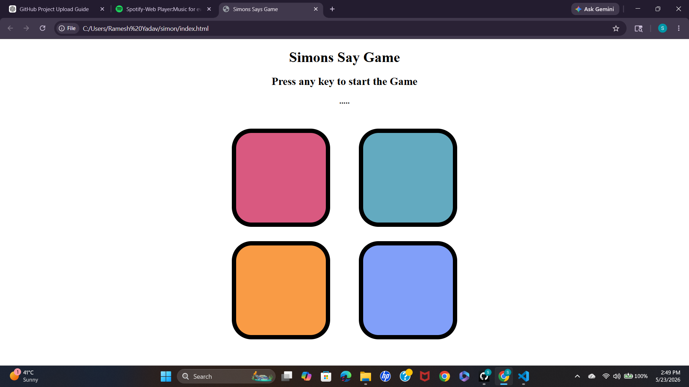

# 🎮 Simon Game

A fun and interactive memory-based game inspired by the classic Simon electronic game. The player must remember and repeat an increasingly difficult sequence of colors and sounds. Built using HTML, CSS, and JavaScript with smooth animations and responsive gameplay.

---

## 🚀 Features

- 🎨 Interactive colorful buttons
- 🧠 Memory-based gameplay
- 🔀 Random sequence generation
- 🔊 Sound effects for each button
- 📈 Increasing difficulty with levels
- ❌ Game over animation
- 🔄 Restart functionality
- 📱 Responsive user interface

---

## 🛠️ Tech Stack

- HTML5
- CSS3
- JavaScript (Vanilla JS)

---

## 📂 Project Structure

```bash
Simon_Game/
│
├── index.html
├── style.css
├── script.js
├── sounds/
├── images/
└── README.md
```
##Installation & setup
# Clone the repository
git clone https://github.com/Simran092004/simon.git

# Move into project folder
cd simon

# Run the project
start index.html

## 🎮 How to Play

1. Press any key to start the game
2. Watch the color/button sequence carefully
3. Repeat the exact same sequence by clicking the buttons
4. After every correct level, a new color is added
5. Remember the complete sequence as the game progresses
6. Clicking the wrong button ends the game
7. Press any key again to restart and play again

## 📸 Screenshots

### Game Interface

